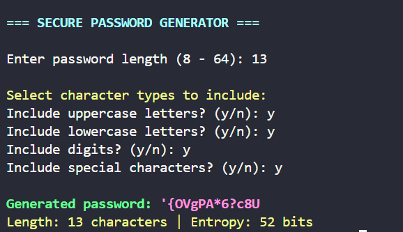

# 🔒 Secure Password Generator

A CLI tool for generating cryptographically strong passwords with customizable complexity.



## 🌟 Features
- Custom password length (8-64 characters)
- Select character types: uppercase, lowercase, digits, symbols
- Automatic entropy calculation
- Input validation and error handling
- Color-coded output

## 🛠️ Requirements
- Python 3.x
- `colorama` library

## 🚀 Usage
```bash
python password_generator.py
```

## ⚙️ Installation
```bash
git clone https://github.com/Parsa-developer/password-generator.git
cd password-generator
pip install -r requirements.txt